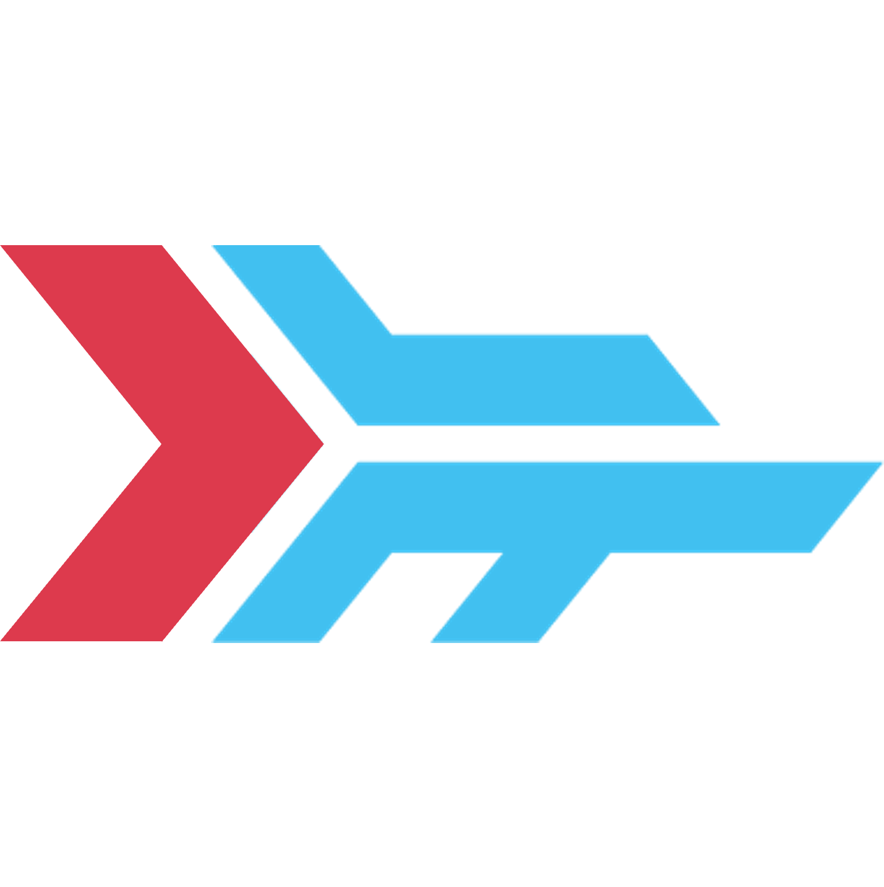
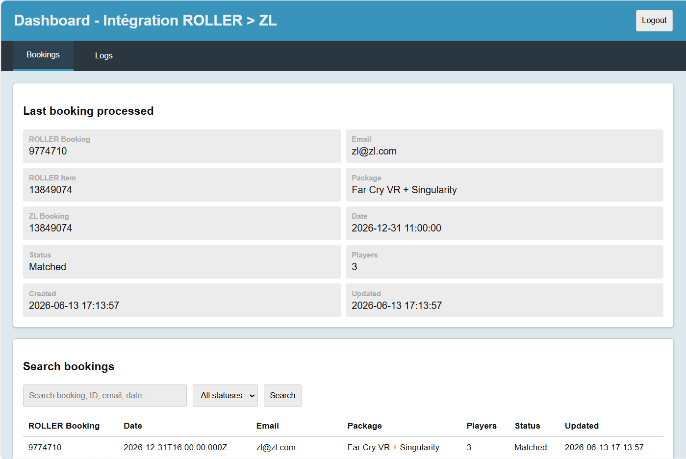

<!-- PROJECT LOGO -->
 

  

  <h3 align="center">ROLLER > ZL Integration</h3>

  

    Save your staff and yourself time and avoid mistakes with this small piece of software that integrates your Roller booking flow with the Zero Latency Portal.
     
     
    <a href="https://zlintegration.com"><strong>Go to the website »</strong></a>
     
  

<!-- TABLE OF CONTENTS -->

  
Table of Contents

  <ol>
    <li><a href="#about-the-project">About the project</a></li>
    <li><a href="#usage">Usage</a></li>
    <li><a href="#getting-started">Get it for your team</a></li>
    <li><a href="#roadmap">Roadmap</a></li>
    <li><a href="#Devs">Devs</a></li>
    <li><a href="#contact">Contact</a></li>
  </ol>

<!-- ABOUT THE PROJECT -->
## About The Project

Automate your Roller to ZL workflow and save your staff and yourself time while avoiding mistakes. This integration software keeps bookings synchronized between your Roller booking system and the Zero Latency Portal, minimizes manual work, and provides dependable real-time updates your team can trust.

**Accurate. Efficient. Reliable.**

Built for venue operations, the integration ensures every reservation created in Roller is automatically reflected in the Zero Latency Portal with the correct game, date, time, player count and customer information.

(<a href="#readme-top">back to top</a>)

<!-- USAGE EXAMPLES -->
## Usage

### Key Features

**Automatic Booking Sync**
Reservations created in Roller are automatically synced to the Zero Latency Portal with the correct game, date, time, player count, and customer information—no manual data entry required.

**Real-Time Updates**
Changes made after booking are automatically reflected in the portal, including player count adjustments, game changes, schedule changes, and cancellations.

**Integration Monitoring Dashboard**
While everything works automatically, you can monitor every synchronization in real time, search through past bookings, and review logs and alerts from a simple web dashboard.

**Email Alerts**
Receive email notifications for your staff if a booking needs manual intervention (e.g., if ZL servers are temporarily down) or if a booking is flagged and requires a discount justification.

**Waiver Integration (Coming Soon)**
Send Roller waivers directly to customers and have them pre-signed in the ZL system when they arrive at your venue.

(<a href="#readme-top">back to top</a>)

<!-- Get it for your team -->
## Get it for your team

**Includes:**
- Integration software installation
- Complete configuration setup
- After-sale support
- Hosting (annual)

Reach out for pricing details and to schedule a call with us.

(<a href="#readme-top">back to top</a>)

<!-- ROADMAP -->
## Roadmap

- [x] Add Booking flow
- [x] Add Email Alerts
- [x] Add Monitoring Dashboard
- [x] Add Private Event Booking
- [ ] Add Waiver Integration

See the [open issues](https://github.com/othneildrew/Best-README-Template/issues) for a full list of proposed features (and known issues).

(<a href="#readme-top">back to top</a>)

<!-- Devs -->
## Devs

(<a href="#readme-top">back to top</a>)

<!-- CONTACT -->
## Contact

Raphaël Dumont - contact@raphaeldumont.com

Project Link: [https://github.com/raphbarniques/zl-roller-integration](https://github.com/raphbarniques/zl-roller-integration)

(<a href="#readme-top">back to top</a>)
